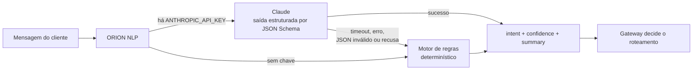
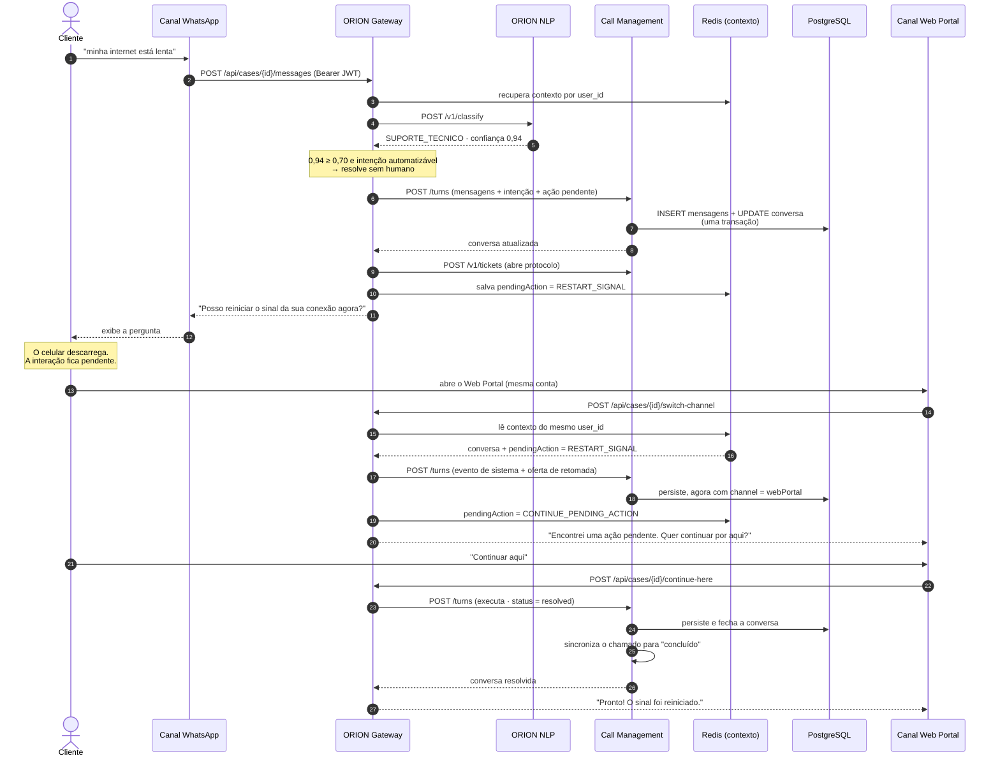
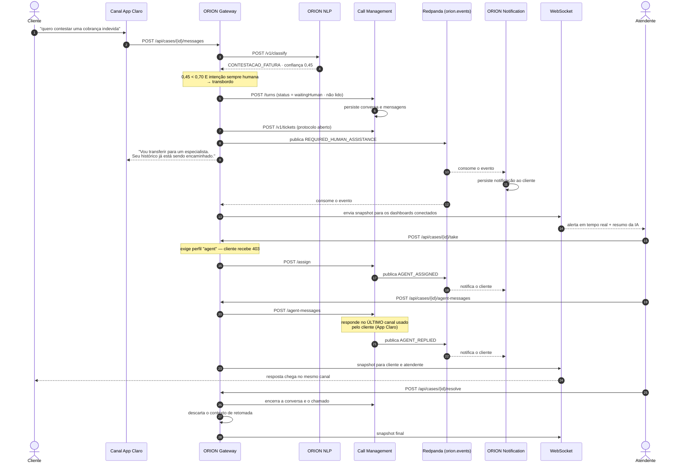
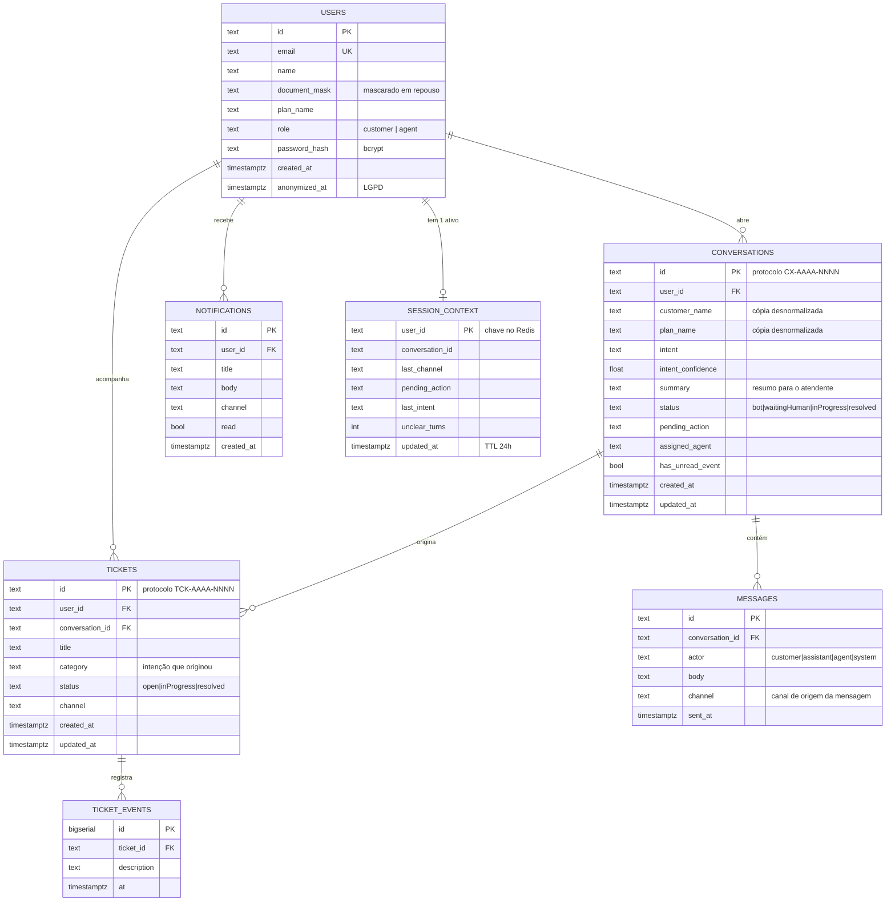

# Orion CX — Arquitetura da solução

Documento de arquitetura do protótipo funcional **Orion CX**, plataforma de atendimento conversacional unificado para a Claro Brasil (Challenge FIAP 2026).

- **Visão de produção**: seção 2 — a arquitetura-alvo em AWS, definida no documento de visão do projeto.
- **Protótipo**: seção 3 — o que foi efetivamente construído e roda localmente.
- **Fluxos**: seção 5 — os dois casos de aceitação, em diagrama de sequência.

---

## 1. O problema e a decisão central

A experiência do cliente Claro hoje é fragmentada entre App, Web e WhatsApp. Cada canal mantém seu próprio estado, então trocar de canal significa recomeçar o atendimento.

A decisão que organiza toda a arquitetura é uma só:

> **O contexto da conversa pertence ao cliente, não ao canal.**

Na prática, o estado da jornada é indexado por `user_id` — nunca por canal ou por dispositivo. É isso que permite ao cliente começar no WhatsApp e terminar no Web Portal sem repetir nada, e é o que a seção 5.1 demonstra ponta a ponta.

A segunda decisão estruturante é o **limiar de automação**: a IA só resolve sozinha o que ela classifica com confiança suficiente. Abaixo disso — ou em temas sensíveis — o caso vai para uma pessoa, com todo o histórico junto. A seção 5.2 demonstra esse caminho.

---

## 2. Arquitetura de produção (AWS)

Esta é a arquitetura-alvo descrita no documento de visão. O protótipo (seção 3) implementa a mesma arquitetura lógica com equivalentes locais.

```mermaid
flowchart TB
    subgraph canais["Canais de atendimento"]
        app["App Claro<br/>(iOS / Android)"]
        web["Web Portal Claro"]
        wpp["WhatsApp<br/>Business API"]
    end

    apigw["Amazon API Gateway<br/>REST/HTTPS · WAF · throttling"]

    subgraph eks["Cluster Kubernetes — Amazon EKS"]
        gw["ORION Gateway<br/>orquestrador da jornada"]
        nlp["ORION Motor NLP/IA<br/>intenção + confiança"]
        auth["ORION Authenticator<br/>identidade e token"]
        call["ORION Call Management<br/>conversas e chamados"]
        notif["ORION Notification<br/>avisos ao cliente"]
    end

    kafka[["Apache Kafka / Amazon MSK<br/>tópico orion.events"]]

    subgraph dados["Persistência"]
        dynamo[("Amazon DynamoDB<br/>sessão e contexto")]
        rds[("Amazon RDS PostgreSQL<br/>usuários, conversas, chamados")]
        s3[("Amazon S3<br/>anexos, logs, mídia")]
    end

    sns["Amazon SNS<br/>push · SMS · e-mail"]
    bedrock["Modelo de linguagem<br/>(Claude / Amazon Bedrock)"]
    dash["Dashboard do atendente<br/>WebSocket"]

    app --> apigw
    web --> apigw
    wpp --> apigw
    apigw --> gw

    gw -- gRPC --> nlp
    gw -- gRPC --> auth
    gw -- gRPC --> call
    nlp --> bedrock

    gw -- publica --> kafka
    call -- publica --> kafka
    kafka -- consome --> notif
    kafka -- consome --> gw
    notif --> sns
    gw <-. tempo real .-> dash

    gw --> dynamo
    auth --> rds
    call --> rds
    notif --> rds
    call --> s3
```

**Responsabilidade de cada serviço**

| Serviço | Responsabilidade | Dados que possui |
|---|---|---|
| **ORION Gateway** | Ponto de entrada único. Orquestra a jornada: classifica, decide o roteamento, persiste o turno, publica eventos e mantém o WebSocket. | Sessão/contexto (DynamoDB) |
| **ORION Motor NLP/IA** | Converte linguagem natural em intenção + score de confiança calibrado. | Nenhum (stateless) |
| **ORION Authenticator** | Cadastro, login, emissão e validação de token. | `auth.users` |
| **ORION Call Management** | Ciclo de vida de conversas, mensagens e chamados. | `calls.*` |
| **ORION Notification** | Consome eventos do barramento e notifica o cliente. | `notify.notifications` |

Nenhum serviço lê a tabela de outro. O Call Management guarda uma cópia desnormalizada do nome/plano do cliente em vez de fazer join com o Authenticator — é isso que permite separar os bancos por serviço em produção sem reescrever consultas.

---

## 3. Arquitetura do protótipo

O protótipo roda inteiro em Docker Compose, com os mesmos cinco serviços em Go e equivalentes locais para cada peça gerenciada da AWS.

```mermaid
flowchart TB
    subgraph browser["Navegador"]
        flutter["App Flutter Web<br/>simula App · Web Portal · WhatsApp"]
    end

    subgraph publica["rede orion-public"]
        nginx["orion-web<br/>nginx :8080"]
        gw["orion-gateway :8000<br/>REST + WebSocket"]
    end

    subgraph interna["rede orion-internal (não exposta ao host)"]
        auth["orion-auth :8011"]
        nlp["orion-nlp :8010"]
        call["orion-callmgmt :8012"]
        notif["orion-notification :8013"]
        seed["orion-seed<br/>job idempotente"]
    end

    subgraph infra["Infraestrutura"]
        pg[("PostgreSQL 16<br/>schemas auth · calls · notify")]
        redis[("Redis 7<br/>contexto de sessão")]
        panda[["Redpanda<br/>protocolo Kafka"]]
    end

    claude["API Claude<br/>(opcional)"]

    flutter --> nginx
    flutter -->|REST + WS| gw
    gw --> auth
    gw --> nlp
    gw --> call
    gw --> notif
    nlp -.->|se houver chave| claude

    gw -->|publica| panda
    call -->|publica| panda
    panda --> notif
    panda --> gw

    gw --> redis
    auth --> pg
    call --> pg
    notif --> pg
    seed --> auth
    seed --> call
```

### 3.1 Mapeamento produção → protótipo

| Componente de produção (AWS) | Equivalente no protótipo | Observação |
|---|---|---|
| Amazon API Gateway | REST exposto pelo próprio ORION Gateway (Go) | Único serviço publicado no host; os outros quatro ficam na rede interna |
| Amazon EKS + microsserviços Go | Cinco contêineres Docker, um por serviço | Mesmo binário, selecionado por `-service=<nome>` |
| gRPC interno | HTTP/JSON interno | **Simplificação** — ver seção 7.1 |
| Amazon DynamoDB | Redis 7 | Mesmo papel: contexto de baixa latência com TTL, indexado por `user_id` |
| Amazon RDS | PostgreSQL 16 | Um banco, três schemas isolados por serviço |
| Amazon S3 | — | **Fora do escopo desta versão** — ver seção 7.4 |
| Apache Kafka / MSK | Redpanda | Protocolo Kafka; o código do cliente é o mesmo |
| Amazon SNS | ORION Notification (persistência + log + WebSocket) | **Simplificação** — ver seção 7.2 |
| Modelo de linguagem | API Claude via SDK oficial Go, com fallback por regras | Ver seção 4 |

### 3.2 Stack

| Camada | Tecnologia | Por quê |
|---|---|---|
| Backend | **Go 1.25**, `chi` (HTTP), `pgx` (Postgres), `go-redis`, `kafka-go`, `gorilla/websocket` | Coerência com o documento de visão, que define microsserviços em Go; binário estático, sem runtime, contêiner pequeno e boot rápido |
| IA / NLU | `anthropic-sdk-go` + motor de regras determinístico | O SDK oficial evita construir requisições à mão; o motor de regras garante que o protótipo funcione sem chave de API |
| Frontend | **Flutter Web** (Material 3) | Já era a base do protótipo anterior; um único código-fonte cobre a simulação dos três canais em web e mobile |
| Banco relacional | PostgreSQL 16 | Transações reais no ponto crítico: o turno de conversa |
| Sessão/contexto | Redis 7 | Leitura por chave em memória, com TTL de 24 h |
| Eventos | Redpanda | Compatível com Kafka e muito mais leve para rodar em um notebook |
| Autenticação | JWT HS256 + bcrypt | Validação stateless do token em qualquer serviço |
| Tempo real | WebSocket | O dashboard precisa reagir ao evento de transbordo sem polling |

---

## 4. A camada de IA

O ORION Motor NLP/IA expõe um contrato só — `POST /v1/classify` devolve `{intent, confidence, summary, engine}` — atendido por **dois motores intercambiáveis**:



O motor de regras **não é um stub**: é o caminho de contingência de produção. Ele normaliza acentos, casa termos em grupos E-de-OUs (`internet` **e** `lenta`), trata `sim`/`não` apenas quando há pergunta pendente e devolve confiança calibrada por regra. Isso garante que a plataforma nunca deixe o cliente sem resposta — nem quando a API do modelo está fora, nem quando não há chave configurada (RNF007).

O campo `engine` na resposta diz qual motor decidiu, então uma decisão do modelo nunca é confundida com uma decisão de contingência nos logs.

### 4.1 Por que o roteamento tem dois guardas

A decisão de automatizar ou escalar (`internal/gatewaysvc/dialogue.go`) usa **duas condições independentes**:

1. **Limiar de confiança** — abaixo de `ORION_CONFIDENCE_THRESHOLD` (padrão 0,70), vai para humano.
2. **Lista de intenções sempre humanas** — `CONTESTACAO_FATURA` e `CANCELAMENTO` vão para uma pessoa **independentemente da confiança**.

O segundo guarda existe porque confiança alta não é a mesma coisa que decisão segura: contestar uma cobrança mexe no dinheiro do cliente e cancelar mexe no contrato. Um erro nesses dois casos é caro de desfazer, então a política de negócio prevalece sobre o score do modelo.

Há ainda uma terceira regra, de experiência: **a primeira mensagem ambígua não vai para a fila**. O assistente pede um detalhe; só a segunda mensagem sem classificação escala. Jogar o cliente para um humano por causa de uma frase vaga é pior do que fazer uma pergunta.

---

## 5. Fluxos de aceitação

### 5.1 Fluxo A — suporte técnico com continuidade entre canais



O histórico final é **um único fio**, com mensagens carimbadas em dois canais diferentes. É exatamente isso que o teste `TestFlowA_TechnicalSupportAcrossChannels` verifica.

### 5.2 Fluxo B — baixa confiança da IA com transbordo humano



Verificado por `TestFlowB_LowConfidenceHumanHandoff`, incluindo a checagem de que um cliente recebe **403** ao tentar assumir um atendimento.

---

## 6. Modelo de dados



Três detalhes do modelo que carregam decisões:

- **`messages.channel`** guarda o canal de *cada mensagem*, não o canal da conversa. Sem isso não seria possível provar que uma conversa atravessou canais.
- **`session_context` é indexado por `user_id`**, e é a única chave. É a tradução literal de "o contexto pertence ao cliente".
- **`users.anonymized_at`** existe para que a linha sobreviva à exclusão de dados: os protocolos continuam auditáveis mesmo depois de o titular exercer o direito de eliminação (seção 8).

---

## 7. Simplificações assumidas

Todas as simplificações abaixo são deliberadas, com o caminho de produção descrito.

### 7.1 HTTP interno em vez de gRPC

O documento de visão prevê gRPC entre os serviços. O protótipo usa **HTTP/JSON**, com um cliente próprio (`internal/platform/httpx`) que aplica timeout, *retry* com *backoff* exponencial e propagação de `X-Request-Id`.

*Motivo:* gRPC exigiria toolchain de `protoc`, geração de código e arquivos `.proto` versionados — custo alto de infraestrutura para o mesmo comportamento observável nesta escala.
*Em produção:* os contratos viram `.proto`, ganhando validação de schema, streaming e ~30–40% menos bytes por chamada. As assinaturas dos clientes em `internal/gatewaysvc/clients.go` já estão desenhadas para essa troca — cada método é um RPC.

### 7.2 Amazon SNS simulado

O ORION Notification persiste a notificação, registra o envio em log e a entrega via WebSocket no próximo snapshot. Não há push, SMS nem e-mail reais.

*Em produção:* o mesmo `handleEvent` publica em um tópico SNS, com a preferência de canal do cliente vindo do perfil.

### 7.3 Um binário, cinco serviços

Os cinco serviços compartilham um módulo Go e um binário, selecionado por `-service`. São processos e contêineres separados, com bancos logicamente separados por schema.

*Motivo:* elimina duplicação de código de plataforma (logging, middleware, health) sem abrir mão do isolamento em runtime.
*Em produção:* cada serviço vira seu próprio repositório e imagem quando os times se separarem; a fronteira já está desenhada nos schemas e nos clientes HTTP.

### 7.4 Amazon S3 fora do escopo

Nenhum fluxo desta versão envia anexo, então não há armazenamento de objetos. O modelo de dados já reserva o lugar (`tickets`), e a inclusão do MinIO/S3 seria uma adição, não uma refatoração.

### 7.5 Persistência em memória como contingência

Sem `ORION_POSTGRES_URL`, os repositórios caem para implementações em memória que satisfazem exatamente a mesma interface. Isso **não** substitui o banco: o `docker compose up` sempre usa PostgreSQL. Serve para dois casos: rodar o protótipo com `go run` sem nenhuma dependência, e executar a suíte de testes rapidamente.

### 7.6 Token não persistido no navegador

O JWT vive apenas em memória no cliente Flutter; recarregar a página exige novo login.

*Motivo:* guardar token em `localStorage` o expõe a XSS.
*Em produção:* cookie `HttpOnly` + `Secure` + `SameSite=Strict`, com refresh token rotativo.

---

## 8. Segurança e LGPD

| Controle | Implementação |
|---|---|
| Senhas | bcrypt com custo configurável (`internal/platform/security`). O hash nunca é serializado — a struct `domain.User` marca o campo com `json:"-"` |
| Token | JWT HS256 com expiração obrigatória, emissor validado e algoritmo fixado (rejeita `alg: none`) |
| Enumeração de contas | Usuário inexistente e senha errada devolvem a **mesma** resposta 401 |
| Escalação de privilégio | O cadastro público força `role = customer`; contas de atendente só existem via rede interna. Coberto pelo teste `TestPublicRegistrationCannotCreateAgents` |
| Autorização | Middleware de perfil nas rotas do dashboard, mais checagem de propriedade em cada conversa |
| Segredos | Somente por variável de ambiente. `ORION_ENV=production` **recusa iniciar** com o segredo JWT padrão |
| Superfície exposta | Apenas o gateway é publicado; os quatro serviços internos ficam em rede Docker sem portas no host |
| Dados pessoais em log | Um `slog.Handler` próprio mascara CPF, e-mail e telefone e substitui campos sensíveis por `[REDACTED]`, **antes** de o registro sair. A proteção é do logger, não da disciplina de quem chama |
| Direito de eliminação | `DELETE /api/auth/me` apaga conversas, mensagens, chamados e notificações, remove o contexto de sessão e anonimiza o cadastro. Coberto por `TestLGPDErasure` |
| Minimização | O documento do cliente já é armazenado mascarado; o barramento de eventos carrega metadados e no máximo um trecho curto, nunca a mensagem inteira |

---

## 9. Escalabilidade (RNF003)

O protótipo não é submetido a carga real. O que o desenho garante:

**Serviços sem estado.** Nenhum dos cinco guarda estado de requisição em memória — tudo relevante está no Postgres ou no Redis. Escalar é aumentar réplicas; o HPA do EKS faz isso por CPU ou por profundidade de fila.

**Estado compartilhado no lugar certo.** O contexto de jornada fica no Redis (DynamoDB em produção), com leitura O(1) por `user_id`. Uma nova réplica atende um cliente que estava conversando com outra sem nenhuma coordenação.

**Escrita crítica isolada.** O caminho quente é um turno de conversa: uma transação, `SELECT ... FOR UPDATE` na conversa, `INSERT` nas mensagens. O bloqueio é por conversa — duas conversas diferentes nunca disputam.

**Assíncrono onde dá.** Notificação não bloqueia a resposta ao cliente: o gateway publica no Kafka e responde. Consumidores lentos atrasam a notificação, não a conversa. Com o tópico particionado por `conversation_id`, a ordem por conversa é preservada e o paralelismo cresce com as partições.

**Leitura já otimizada.** Índices em `(status, updated_at)` para a fila de atendimento e em `(conversation_id, sent_at)` para o histórico. O carregamento de conversas usa duas consultas, não N+1.

**O gargalo conhecido.** O WebSocket recalcula o snapshot por cliente a cada evento — aceitável para dezenas de atendentes, não para milhões de clientes. Em produção isso vira entrega de *delta* por conversa e um gerenciador de conexões dedicado (API Gateway WebSocket + DynamoDB de conexões), mantendo os serviços de domínio sem estado.

---

## 10. Tolerância a falhas (RNF007)

Cada dependência tem um comportamento definido em caso de falha:

| Falha | Comportamento |
|---|---|
| API do modelo fora, lenta ou recusando | O NLP cai para o motor de regras; o cliente é atendido normalmente |
| Serviço NLP inteiro inacessível | O gateway classifica localmente com o mesmo motor de regras (`engine: rules-gateway-fallback`) |
| Redis fora | O gateway busca a conversa ativa no Call Management; a jornada continua, custando uma consulta |
| Kafka fora | A publicação é registrada em log e engolida; a resposta REST já leva o estado autoritativo. A notificação é perdida, a conversa não |
| Postgres não pronto no boot | Espera com *retry* por até 30 s antes de desistir — é o que faz `docker compose up` funcionar em volume novo |
| Serviço interno instável | Timeout de 3 s e 2 tentativas com *backoff* exponencial; 4xx não é repetido, por ser resposta determinística |
| `panic` em um handler | Middleware de recuperação devolve 500 e mantém o processo vivo |
| Cliente WebSocket lento | Frames são descartados para aquele socket em vez de bloquear os demais |
| Contêiner degradado | `/health` e `/ready` alimentam os health checks do Compose, com `restart: unless-stopped` |

---

## 11. Estrutura do repositório

```text
.
├── ARQUITETURA.md              # este documento
├── FUNCIONALIDADES.md          # RF001–RF009 e RNF001–RNF008 mapeados ao código
├── README.md                   # como subir e como demonstrar
├── docker-compose.yml          # topologia local completa
├── Dockerfile.web              # build do frontend Flutter Web
├── nginx.conf                  # serviço estático do bundle
│
├── backend/                    # monorepo Go
│   ├── cmd/orion/              # binário único, seleciona o serviço por flag
│   ├── internal/
│   │   ├── domain/             # entidades compartilhadas
│   │   ├── config/             # configuração por ambiente
│   │   ├── authsvc/            # ORION Authenticator
│   │   ├── nlpsvc/             # ORION Motor NLP/IA (Claude + regras)
│   │   ├── callsvc/            # ORION Call Management
│   │   ├── notifysvc/          # ORION Notification
│   │   ├── gatewaysvc/         # ORION Gateway (orquestração e políticas)
│   │   ├── seed/               # carga de demonstração idempotente
│   │   ├── e2e/                # testes dos dois fluxos de aceitação
│   │   └── platform/           # db, cache, bus, httpx, wsx, security, logging
│   └── Dockerfile
│
└── lib/                        # frontend Flutter
    ├── core/                   # models, api_client, orion_controller, tema
    ├── screens/                # login, seleção, portal do cliente, dashboard, chamados
    └── widgets/                # componentes compartilhados
```
